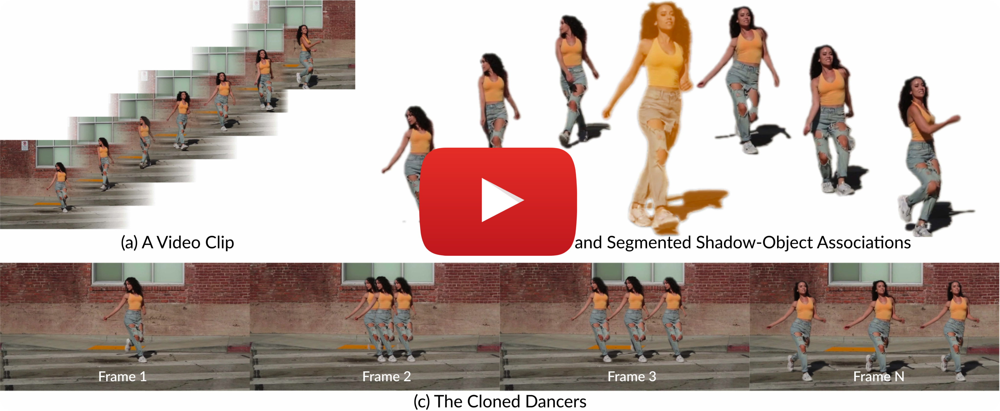

<div align="center">

# Video Instance Shadow Detection Under the Sun and Sky

[Zhenghao Xing](https://harryhsing.github.io)\*, [Tianyu Wang](https://stevewongv.github.io)\*, [Xiaowei Hu](https://xw-hu.github.io), Haoran Wu, [Chi-Wing Fu](https://www.cse.cuhk.edu.hk/~cwfu), [Pheng-Ann Heng](http://www.cse.cuhk.edu.hk/~pheng) (* Joint first authors)

**IEEE Transactions on Image Processing (TIP), 2024**

[[`IEEE Xplore`](https://ieeexplore.ieee.org/document/10704578)] [[`arXiv`](https://arxiv.org/abs/2211.12827)] [[`Video`](https://www.youtube.com/watch?v=uloJr5QlxR8)]



</div>

## Installation
```bash
$ git clone https://github.com/HarryHsing/Video-Instance-Shadow-Detection.git
$ cd Video-Instance-Shadow-Detection
$ conda create -n VISD python=3.8
$ conda activate VISD
$ conda install pytorch==1.13.0 torchvision==0.14.0 torchaudio==0.13.0 pytorch-cuda=11.7 -c pytorch -c nvidia
$ pip install -r requirements.txt
$ cd visd
$ pip install -e .
```

## Demo
### Download Pre-trained Weights
```bash
$ wget -P ./model_zoo/ https://github.com/HarryHsing/Video-Instance-Shadow-Detection/releases/download/weights/model_final.pth
```

### Run the Demo
```bash
$ python vishadow_demo.py --input-name ./assets/videos/skateboard.mp4 --output-name demo_result
```

This command processes the specified input video (`skateboard.mp4`) and produces:

- **Shadow-object association masks** for each frame.
- **Painted frames** and a reconstructed output video.

All results will be saved with the prefix `demo_result` for easy access.

## SOBA-VID Dataset
**Please download the dataset using the links below:**
- [Video](https://github.com/HarryHsing/Video-Instance-Shadow-Detection/releases/download/dataset/frames.zip)
- [Annotation](https://github.com/HarryHsing/Video-Instance-Shadow-Detection/releases/download/dataset/annotations.zip)

## Citation
**The following is a BibTeX reference:**

``` latex
@article{xing2024video,
  title={Video Instance Shadow Detection Under the Sun and Sky},
  author={Xing, Zhenghao and Wang, Tianyu and Hu, Xiaowei and Wu, Haoran and Fu, Chi-Wing and Heng, Pheng-Ann},
  journal={IEEE Transactions on Image Processing},
  year={2024},
  publisher={IEEE}
}
```

## TODO
- Training Code
- Evaluation Code
- Gradio Interface

## Acknowledgement
This repo is largely based on [SSIS](https://github.com/stevewongv/SSIS) and [InternGPT](https://github.com/OpenGVLab/InternGPT/tree/main).
Thanks for their excellent works.

